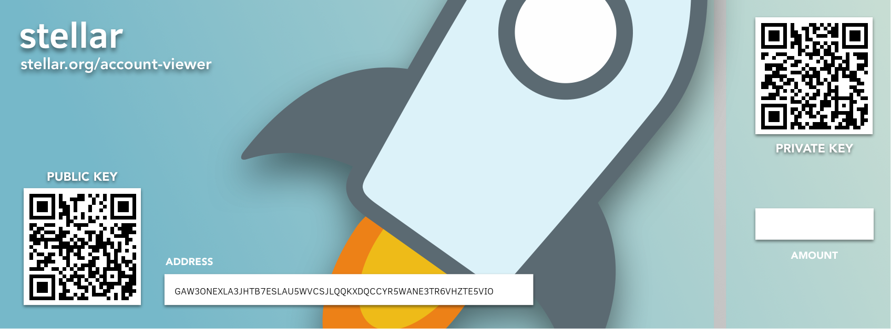

# stellar-paper-wallet
CLI tool for making fancy printable stellar paper wallets to hold your lumens (XLM).



## Getting started

### Dependencies
- Make sure you have Python 3.6
- You would need to install [Pillow](http://pillow.readthedocs.io/en/3.0.x/installation.html), not PIL.
- Install qrcode 5.3 [here](https://pypi.python.org/pypi/qrcode).
- Install [py-stellar-base](https://github.com/StellarCN/py-stellar-base)

TLDR;
```
sudo pip install Pillow
sudo pip install qrcode
sudo pip install stellar-base
```

### Commands
`python spw.py d1` creates a png of random keypair with design 1

`python spw.py d2` creates a png of random keypair with design 2

`python spw.py d3` creates a png of random keypair with design 3

`python spw.py --design -k` creates a png of public/private keypair with design

Example usage: `python spw.py d1 -k`. The program will then ask you to paste in your secret key as an input, so that the secret key is not exposed in the command line history.

## Credit

Credit goes to /r/C_Storm from [here](https://www.reddit.com/r/Stellar/comments/7iw50n/i_designed_some_stellar_gift_cards_you_can_use/) for the wallet design.
